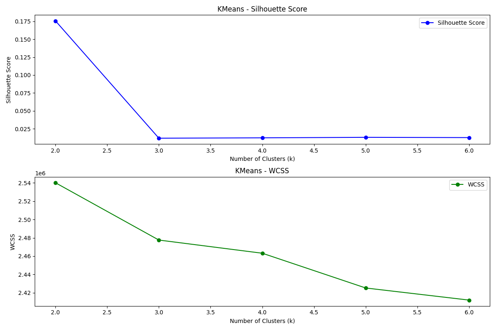

# C3MOD - Cancer Clustering and Characterization using Multi-Omics Data

**C3MOD** is a Python tool that identifies cancer subtypes in multi-omics data using unsupervised clustering algorithms and enables a variety of analyses on the identified subtypes. It provides flexibility for customized analysis, allowing users to select the cancer type, algorithm, parameters, and analyses that suit their research focus.

---

## Table of Contents

- [Requirements](#requirements)
- [Installation](#installation)
- [Input Data](#input-data)
- [Running C3MOD](#running-c3mod)
- [Detailed Analysis Workflow](#detailed-analysis-workflow)
  - [Survival Analysis](#survival-analysis)
  - [Mutation Analysis](#mutation-analysis)
  - [Stage Analysis](#stage-analysis)
  - [Immune Analysis](#immune-analysis)

---

## Requirements
- **Python Version**: >=3.10

## Installation

1. Clone the GitHub repository:
   ```bash
   git clone https://github.com/rajulshakya777/C3MOD.git
2. Create a virtual python environment:
   ```bash
   python3 -m venv <env>
3. Activate the virtual environment:
   ```bash
   source <env>/bin/activate

## Input Data
Sample Input data for TCGA-LUAD (Lung adenocarcinoma) is given in data/input_data/TCGA-data directory.
To perform analysis on any other cancer type 
1. Level-3 TCGA Cancer data can be downloaded from - https://xenabrowser.net/datapages

# Running C3MOD

<div style="text-align: center;">
    <h2>
        Video Tutorial
        
    </h2>
    <a href="https://www.youtube.com/watch?v=QAPCT9JrIp4">
        
    </a>
</div>


*Click the image above to watch the step-by-step guide to run C3MOD python tool*


## Run `main.py`script

### Step 1: Python and R Packages Installation
- Install all required Python and R packages necessary for the analysis.

### Step 2: Data Pre-Processing
- **User Input**: Select cancer data type from the menu.
- **Available Cancer Data**: 
  `['TCGA-ACC', 'TCGA-BLCA', 'TCGA-BRCA', 'TCGA-CESC', 'TCGA-CHOL', 'TCGA-COAD', 'TCGA-DLBC', 'TCGA-ESCA', 'TCGA-GBM', 'TCGA-HNSC', 'TCGA-KICH', 'TCGA-KIRC', 'TCGA-KIRP', 'TCGA-LAML', 'TCGA-LGG', 'TCGA-LIHC', 'TCGA-LUAD', 'TCGA-LUSC', 'TCGA-MESO', 'TCGA-PAAD', 'TCGA-PCPG', 'TCGA-PRAD', 'TCGA-READ', 'TCGA-SARC', 'TCGA-STAD', 'TCGA-TGCT', 'TCGA-THCA', 'TCGA-THYM', 'TCGA-UCEC', 'TCGA-UCS', 'TCGA-UVM']`
- **Processing Steps**: Data cleaning, standardization, PCA for dimensionality reduction, and data integration.
- **Output**: Summary message confirming pre-processing completion.

### Step 3: K Recommendation (Cluster Count)
- **User Input**: Choose the algorithm for which to find the optimal K value:
  1. SNF
  2. KMeans
  3. Hierarchical Clustering
  4. Spectral Clustering
  5. Fuzzy C-Means
  6. Run All

- **Recommendation Method**: Based on silhouette scores and WCSS (within-cluster sum of squares) methods. Plots are saved in the `output/recommended_K` directory.

  **Example**: Based on the silhouette score and WCSS plot for KMeans, the tool recommends an optimal K (cluster count) to use.  
  

### Step 4: Algorithm Selection and Clustering
- **User Input**: Select the clustering algorithm and specify K (cluster count).
  - **Available Algorithms**:
    1. SNF
    2. KMeans
    3. Hierarchical Clustering
    4. Spectral Clustering
    5. Fuzzy C-Means
    6. Run All

- **Optional Parameters for SNF**:
  1. Number of neighbors for constructing affinity matrix (Default: 20)
  2. Hyperparameter alpha for affinity matrix (Default: 0.5)
  3. Number of SNF iterations (Default: 15)
  4. Keep default values

- **Output**: Results are saved in the `output/clustering_results` directory.
  1. **Classification File**

  
     
     
  1. **PCA Plots**


  

### Step 5: Further Analysis Selection
- Choose the type of analysis to perform:
  1. Survival Analysis
  2. Mutation Analysis
  3. Stage Analysis
  4. Immune Analysis
  5. Run All

- **Example**: Selecting option 5 runs all analyses sequentially.

---

## Detailed Analysis Workflow

### Survival Analysis
- **Method**: Cox Proportional-Hazards Model (coxph).
- **Output**: Results are saved in the `output/survival_analysis` directory.

  **KMeans Survival Plot**:


  **Interpretation**:
  1. **Cluster-Specific Survival Trends**: Each cluster shows unique survival curves with varying survival probabilities.
  2. **Variability**: Shaded areas represent the range of survival times within each cluster.
  3. **Significance Testing**: Pairwise p-values show statistical significance (low values) or similarity (high values) between clusters.
  4. **Cluster Comparison**: Survival curves and p-values highlight differences in survival outcomes.
  5. **Potential Clinical Insights**: Variations in survival suggest possible biological or clinical differences among clusters.

### Mutation Analysis
- **Input Data**: Identified clusters and gene mutation data.
- **Analyses Performed**:
  1. **Chi-Square Test**: Significance test for each gene between pairs of clusters.
     
        

      **Interpretation**: Example - For gene CPHL1P, a p-value of 0.99941 between clusters 1 and 2 indicates a low significance difference.
 
  2. **Top 5 Significant Genes**: Genes with the lowest p-values between cluster pairs.
     

     **Interpretation**: Genes such as BMP8A, FCGR3B, REEP6, IGKV1D-12, and GNG4 show the lowest p-values, meaning they are highly significant 
        between cluster pairs 1 and 3.

  4. **Cluster Similarity**: Correlation matrix shows mutation similarity between clusters.
     

     **Interpretation**:
     - **High Correlation Values**: Correlation coefficients close to 1 suggest strong mutation pattern similarities.
     - **Statistical Significance**: Extremely low p-values (e.g., 1.000e-100) indicate high statistical significance.
     - **Cluster Similarities**: Clusters 1 and 3, as well as clusters 2 and 3, show high correlation values (0.871 and 0.749), suggesting similar mutation patterns.

  5. **Total Mutations per Cluster**: Shows total mutations for each cluster.
     

     **Interpretation**: Distinct mutation counts suggest significant differences between clusters based on mutation frequency.

  6. **Genes vs. P-Values**: Displays gene significance across cluster pairs.
     

     **Interpretation**: Few genes in clusters 1 and 2 (shown in red) have a p-value < 0.05, indicating low evidence for significant differences between these clusters.

### Stage Analysis
- **Objective**: Show stage distribution among patients across clusters.
- **Input Data**: Stage data and identified clusters.


  

  **Interpretation**: The plot shows how the percentage of patients with different cancer stages distribution varies across clusters. Such insights can help to decide the more aggressive treatment strategies for a particular cluster patients. 

### Immune Analysis
- **Input Data**: Immune cell data and cluster IDs.
- **Output**: Bar plots showing immune-related characteristics of each cluster.


  **Interpretation**:
   - **Strong Similarity Between Clusters**: The R-values are very high (close to 1) for all cluster comparisons, indicating a strong similarity in immune scores between the clusters. This suggests that these clusters may have similar immune characteristics.

   - **High Statistical Significance**: The extremely low p-values (e.g., 9.446e-179) show that these similarities are statistically significant, meaning the correlation results are highly reliable and unlikely to be due to random chance.

## Acknowledgments
C3MOD leverages cutting-edge clustering techniques, genomic data processing, and statistical analysis to identify clinically relevant patterns in cancer data.
