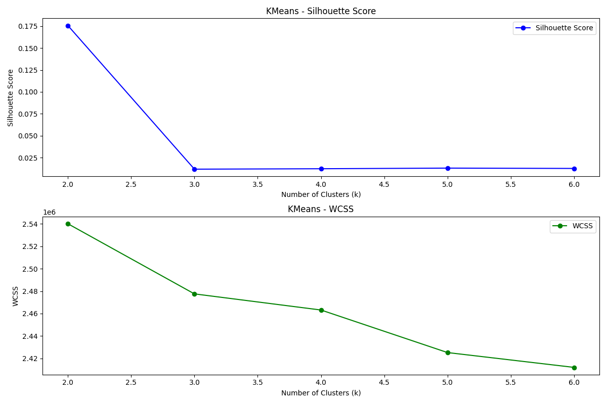

# C3MOD - Cancer Clustering and Characterization using Multi Omics Data
C3MOD is a python tool that identify cancer subtypes in multi omics data using unsupervised clustering algorithms and perform the various analysis on the identified subtypes.
The main objective of C3MOD is to provide user a centralized tool with complete flexibility of customized analysis to decide the type of cancer, algorithm, algorithm parameters and analysis so that, user can decide
based on it's area of interest user can draw the conclusion based on the analysis it has performed.

# Requirements
This tool can be download from https://github.com/rajulshakya777/C3MOD.git

Recommended python version is : >=3.10

# Steps for Running C3MOD
1. Clone the github repositry using 'git clone https://github.com/rajulshakya777/C3MOD.git' in your Local machine.
2. Create a virtual python environment : python3 -m venv <env>
3. Activate the environemtn : source <env>/bin/activate
4. Run main.py file present inside c3mod_lib directory : python main.py

# Running C3MOD 
## Example 1: Run main.py

Step 1: Python and R packages installation
- Install all the required Python and R packages required for analysis

Step 2: Data Pre-Processing
- User input : Select the cancer data from the menu 
- Cancer data : ['TCGA-ACC', 'TCGA-BLCA', 'TCGA-BRCA', 'TCGA-CESC', 'TCGA-CHOL', 'TCGA-COAD', 'TCGA-DLBC', 'TCGA-ESCA', 'TCGA-GBM', 'TCGA-HNSC', 'TCGA-KICH', 'TCGA-KIRC', 'TCGA-KIRP', 'TCGA-LAML', 'TCGA-LGG', 'TCGA-LIHC', 'TCGA-LUAD', 'TCGA-LUSC', 'TCGA-MESO', 'TCGA-PAAD', 'TCGA-PCPG', 'TCGA-PRAD', 'TCGA-READ', 'TCGA-SARC', 'TCGA-STAD', 'TCGA-TGCT', 'TCGA-THCA', 'TCGA-THYM', 'TCGA-UCEC', 'TCGA-UCS', 'TCGA-UVM']
- Data Pre-Processing includes Data cleaning, standardization, Dimensionality reduction using PCA and Data Integration.
- Prints Analysis Summary and the Pre-Processing completion message

Step 3: Recommend K as per your choice of data and algorithm
- User input : Select the algorithm for which you want to find the recommended K from the menu

1. SNF
2. KMeans
3. Hierarchical Clustering
4. Spectral Clustering
5. Fuzzy C-Means
6. Run All

Recommend K based on Silhouti score and WCSS methods.
Silhouti Scores and WCSS Plots Will be saved to recommended_K directory inside output directory
Example : Based on generated Silhouti score and WCSS plot for KMeans algorithm, tool will recommend you the best K (number of cluster) to choose else
you can decide by your own choice also
  

Step 4: User Input: Algorithm Selection and K (number of cluster)

1. SNF
2. KMeans
3. Hierarchical Clustering
4. Spectral Clustering
5. Fuzzy C-Means
6. Run All

You need to select the algorithm from the menu and enter any integer k (between 2 and 7)
If you choose SNF, you can also change some other algorithm parameters from the below menu or you can keep them default by selecting option 4 

1. Number of neighbors for constructing affinity matrix (Default is 20)
2. Hyperparameter alpha for constructing affinity matrix (Default is 0.5)
3. Number of iterations for SNF (Default is 15)
4. No (Keep the default values)

Based on your choice, algorithm will run and all the results will be saved in clustering_resutls directory inside output directory.

1. Classification file

2. PCA plots

Once clustering is completed, You will have menu to select the analysis you wanted to peroform on the identified clusters 

Select the further analysis you want to perform:
1. Survival Analysis
2. Mutation Analysis
3. Stage Analysis
4. Immune Analysis
5. Run All

Once user gives the input, it will perform the analysis based on the user choice

## Example 
User selects option 5 to Run All analysis

Step 5 : Survival analysis
Survival analysis will be performed using Cox Proportional-Hazards Model (coxph) method and save the resutls to survival_analysis folder inside output folder

KMeans survival plot

Interpretation: Following interpretation can be made from the above survival analysis plot 
1. Cluster-Specific Survival Trends: Each cluster has distinct survival curves, showing different survival probabilities over time.
2. Variability: The shaded areas around each curve show the range where most survival times fall, with wider areas meaning more variety within that group.
3. Significance Testing: Pairwise p-values indicate statistically significant differences (low values) or similarities (high values) between clusters.
4. Cluster Comparison: Survival curves and p-values together highlight which clusters have better or worse survival outcomes.
5. Potential Clinical Insights: Differences in survival may suggest biological or clinical factors unique to each cluster, guiding further analysis.

Step 6 : Mutation analysis
Input data : Identified Clusters, Gene Mutation Data
Below analysis will be performed and results will be saved to mutation_analysis folder in output directory
1. Chi sqaure test : Chi square test peroformed to calcuate the significant difference for each gene between different pair of clusters.

Interpretation Example : For Gene CPHL1P, P-value 0.99941 between cluster 1 and cluster 2 shows very less signigicant difference.

2. Top 5 genes showing significant difference (Lowest P-value) between each pair of cluster

Interpretation Example : Genes BMP8A, FCGR3B, REEP6, IGKV1D-12 and GNG4 showing lowest p-values meaning are highly significant between cluster pair a 1 and 3. 

3. Similarity between cluster pairs : Similarity between clusters is shown using correlation between each pair of clusters and correlation matrix is saved to mutation_analysis folder.

   
Possible Interpretation Example : From the above plot, some interpretation examples could be
- High Correlation Values: The R-values (correlation coefficients) between clusters show how similar they are based on mutations. Values close to 1 indicate a strong positive similarity between clusters.
- Statistical Significance: Each R-value has an associated p-value, with extremely low p-values (like 1.000e-100) indicating that these similarities are statistically significant.
- Cluster Similarities: Clusters 1 and 3, as well as Clusters 2 and 3, show high correlation values (0.871 and 0.749, respectively), suggesting they share similar mutation patterns.

4. Total mutation in each cluster : Bar graph of sum of total number of mutations in all the patient's of each cluster saved in mutation_analysis folder

  
Possible Interpretation : More evidence that cluster are significantly different based on the number of mutations  

5. Number of genes vs P-values between each pair of cluster : Number of genes vs P-values between each pair of cluster showing, how many genes are showing stastical significance.

Possible Interpretation : There are very few genes in cluster 1 and cluster 2 (shown in red) whose p-value is less than 0.05 are against the evidence that clusters are significantly different.

Step 7 : Stage analysis
Stage analysis is to show the stage distribution among different patients across different clusters.

Input data : Stage data + Identified Clusters

Interpration : It can be interpretaed that Cluster 3 patieints health is better than Cluster 1 Patients which requires more aggressive treatment for cluster 1 patients.

Step 8 : Immune analysis
Immune analysis is to show similarity matrix between clusters based on the immunescores.

Interpration : 
1. Strong Similarity Between Clusters: The R-values are very high (close to 1) for all cluster comparisons, indicating a strong similarity in immune scores between the clusters. This suggests that these clusters may have similar immune characteristics.

2. High Statistical Significance: The extremely low p-values (e.g., 9.446e-179) show that these similarities are statistically significant, meaning the correlation results are highly reliable and unlikely to be due to random chance.

Once All the analysis is completed, we see a "Analysis completed successfully message" on the console.
